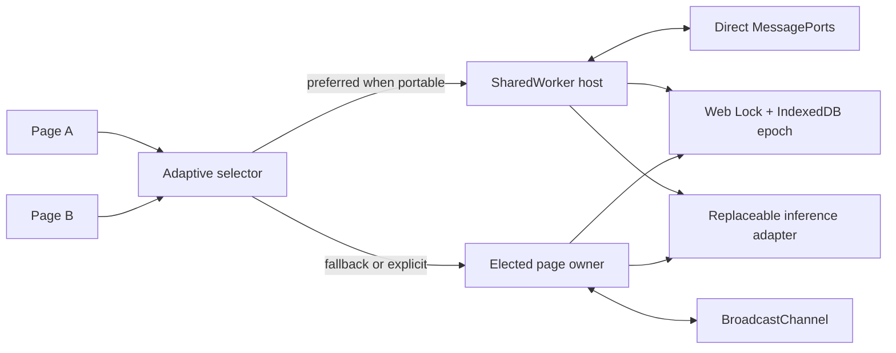

# TabLoom

[](https://github.com/aantenore/tabloom/actions/workflows/ci.yml)
[](https://github.com/aantenore/tabloom/actions/workflows/browser.yml)
[](https://github.com/aantenore/tabloom/actions/workflows/codeql.yml)

**Let multiple browser tabs share one local AI runtime safely.**

## In plain English

- **Problem:** if every tab in one web application starts its own local model,
  the tabs can duplicate expensive initialization, compete for device memory,
  and disagree about which runtime owns an in-flight request.
- **What it does:** TabLoom elects one active runtime owner for the same-origin
  application and lets sibling pages use it through bounded, streaming sessions.
  If a SharedWorker is not a safe lifecycle choice, it can select a page owner
  instead.
- **Who it is for:** web developers adding private, on-device inference to
  multi-page or multi-tab browser applications.
- **Concrete example:** open two tabs of the included Vite/WebLLM starter. Both
  tabs use one compatible owner and model configuration rather than initializing
  independent engines. If ownership changes, a newer ownership number ensures
  that a late result from the old owner is ignored.

| Feature                                                     | Real-world benefit                                                                                              |
| ----------------------------------------------------------- | --------------------------------------------------------------------------------------------------------------- |
| One owner with an always-increasing ownership number        | Applications can avoid unnecessary duplicate model runtimes and ignore results from an old owner.               |
| Adaptive SharedWorker or page-owner topology                | The application can keep one coordination contract while choosing the safer lifecycle for the browser.          |
| Runtime fingerprint negotiation                             | Tabs with incompatible model or application configurations are rejected before inference starts.                |
| Bounded queue, cancellation, timeouts, and takeover         | A slow, closed, or replaced tab does not leave unlimited work waiting without lifecycle controls.               |
| Streaming sessions with epoch-aware retry events            | The UI can clear partial output and restart cleanly after ownership changes.                                    |
| Provider-neutral adapter boundary and prompt-free telemetry | Teams can change inference runtimes and diagnose coordination without placing prompt text in TabLoom telemetry. |

> **Maturity and limits:** TabLoom is an alpha coordination library, not a model
> runtime. The WebLLM path has been verified with an actual model on
> Chrome/WebGPU, but that is not a compatibility claim for every browser, GPU,
> model, or future provider version. Coordination is limited to pages within the
> same browser security boundary (the same origin); Transformers.js remains an
> unverified integration seam.

## Technical overview

TabLoom is a provider-neutral, same-origin browser inference control plane. It coordinates sibling pages through an adaptive topology: a SharedWorker host when the runtime and lifecycle are suitable, or a fenced page owner when they are not.

It supplies the coordination layer, not a model runtime: exclusive ownership, monotonic fencing epochs, runtime identity negotiation, bounded admission, streaming sessions, cancellation, timeouts, takeover, and privacy-safe telemetry.

The core stays provider-neutral. A deterministic adapter exercises lifecycle behavior in every CI job, while a dedicated optional adapter composes [WebLLM 0.2.84](https://github.com/mlc-ai/web-llm) without bundling it into the core package.

## Why

Loading the same local model in every open page can multiply scarce device memory. Browser runtimes already solve inference and browser primitives already move messages; TabLoom focuses on the missing inference-specific control plane across topology selection, owner changes, and mixed application deployments.

## Architecture



- `auto`, `shared-worker`, and `page-owner` make topology policy explicit.
- SharedWorker clients negotiate over direct `MessagePort` connections before the host initializes the adapter.
- The page-owner path uses BroadcastChannel and remains the portable baseline.
- Web Locks elect exactly one runtime owner inside a storage bucket.
- An IndexedDB transaction advances the monotonic fencing epoch while the lock is held.
- Protocol v2 rejects incompatible runtime fingerprints before inference work is admitted.
- Ports keep election, transport, clock, IDs, telemetry, and inference replaceable.
- Clients reject stale epochs and accept at most one terminal result per session.

## Install the prerelease archive

The alpha is distributed as a GitHub release archive rather than an npm registry publication.

```bash
curl -LO https://github.com/aantenore/tabloom/releases/download/v0.4.0-alpha.1/tabloom-0.4.0-alpha.1.tgz
pnpm add ./tabloom-0.4.0-alpha.1.tgz
```

Verify the adjacent `.sha256` asset before installing in a controlled delivery pipeline.

For a complete Vite consumer using only public package exports, start with the
[pinned WebLLM starter](examples/vite-webllm/README.md). Its page and
SharedWorker share one configuration manifest and the repository package smoke
builds it against a freshly packed TabLoom archive.

## Quick start

```ts
import {
  createRuntimeFingerprint,
  DeterministicInferenceAdapter,
  createBrowserBroker,
} from '@aantenore/tabloom';

const runtimeFingerprint = await createRuntimeFingerprint({
  adapter: 'deterministic-text@1.0.0',
  build: 'my-app@1',
  configuration: 'default',
});

const broker = createBrowserBroker({
  adapter: new DeterministicInferenceAdapter(),
  config: {
    namespace: 'my-app-local-inference',
    queueCapacity: 8,
    requestTimeoutMs: 30_000,
    runtimeFingerprint,
  },
});

const unsubscribe = broker.subscribe((snapshot, event) => {
  console.log(snapshot.role, snapshot.epoch, event?.type);
  if (event?.type === 'retry') {
    // Clear any partial presentation: streaming restarts on the new epoch.
  }
});

await broker.start();

const session = broker.request({ text: 'Explain fenced ownership.' });
try {
  for await (const chunk of session) {
    console.log(chunk.text);
  }
  console.log(await session.result);
} finally {
  unsubscribe();
  await broker.stop();
}
```

The deterministic adapter makes lifecycle behavior reproducible. Replace it with an application adapter for a real runtime; see [adapter integrations](docs/integrations.md).

The fingerprint is a compatibility identity, not a secret or an authentication token. Derive it from the deployed adapter, model, build, and behavior-affecting configuration. Pages that use one namespace must use the same fingerprint.

## Adaptive SharedWorker topology

With Vite, import the host using its native `?sharedworker` constructor and pass a `workerFactory`. No placeholder worker URL is required:

```ts
import TabLoomHost from './tabloom-host?sharedworker';
import { DeterministicInferenceAdapter } from '@aantenore/tabloom';
import { createAdaptiveBrowserBroker } from '@aantenore/tabloom/shared-worker';
import { runtimeFingerprint } from './runtime-identity';

const selection = await createAdaptiveBrowserBroker({
  adapter: new DeterministicInferenceAdapter(),
  config: {
    namespace: 'my-app-local-inference',
    queueCapacity: 8,
    requestTimeoutMs: 30_000,
    runtimeFingerprint,
  },
  topology: {
    mode: 'auto',
    name: 'my-app-local-inference',
    workerFactory: ({ name }) => new TabLoomHost({ name }),
  },
});

console.log(selection.topology, selection.fallbackReason);
await selection.broker.start();
```

The worker entry installs the host with the same namespace, broker configuration, adapter, and fingerprint:

```ts
// tabloom-host.ts
import { DeterministicInferenceAdapter } from '@aantenore/tabloom/adapters';
import { createSharedWorkerBrokerHost } from '@aantenore/tabloom/shared-worker';
import { runtimeFingerprint } from './runtime-identity';

createSharedWorkerBrokerHost({
  adapter: new DeterministicInferenceAdapter(),
  config: {
    namespace: 'my-app-local-inference',
    queueCapacity: 8,
    requestTimeoutMs: 30_000,
    runtimeFingerprint,
  },
  scope: globalThis,
});
```

Generate `runtimeFingerprint` once from a shared manifest with `createRuntimeFingerprint`; both entry points must resolve the same digest. `auto` uses the portable lifecycle policy by default. On Apple WebKit user agents without a Chromium-family lifecycle, it selects `page-owner` before SharedWorker startup. Explicit `shared-worker`, and `auto` with `lifecyclePolicy: 'best-effort'`, remain opt-in experimental choices on those browser lifecycle implementations.

Fallback is deliberately transactional. Construction, capability, or transport failures before commit can select `page-owner`; a failure after the client commits to a prepared host fails startup instead of starting a second runtime.

## Optional WebLLM adapter

Install the tested peer explicitly, then import only the dedicated subpath:

```bash
pnpm add @mlc-ai/web-llm@0.2.84
```

```ts
import { createBrowserBroker } from '@aantenore/tabloom';
import { createRuntimeFingerprint } from '@aantenore/tabloom/core';
import { WebLlmInferenceAdapter } from '@aantenore/tabloom/adapters/webllm';

const runtimeFingerprint = await createRuntimeFingerprint({
  adapter: 'webllm@0.2.84',
  build: 'my-app@1',
  configuration: 'default',
  model: 'SmolLM2-360M-Instruct-q4f16_1-MLC',
});

const broker = createBrowserBroker({
  adapter: new WebLlmInferenceAdapter({
    modelId: 'SmolLM2-360M-Instruct-q4f16_1-MLC',
    onProgress: ({ progress, text }) => {
      console.log(Math.round(progress * 100), text);
    },
  }),
  config: {
    maxConcurrent: 1,
    namespace: 'my-app-webllm',
    queueCapacity: 4,
    requestTimeoutMs: 180_000,
    runtimeFingerprint,
  },
});

await broker.start();
const session = broker.request({
  messages: [{ role: 'user', content: 'Explain fenced ownership.' }],
  stream_options: { include_usage: true },
});

for await (const chunk of session) {
  console.log(chunk.choices[0]?.delta.content ?? '');
}
console.log(await session.result);
```

The host chooses the model, model source, runtime config, cache policy, and prompt history. The request cannot switch the configured model. Keep `maxConcurrent: 1`: WebLLM interruption is engine-wide and the adapter rejects a competing generation.

## Session semantics

| Concern                  | Alpha contract                                                                                     |
| ------------------------ | -------------------------------------------------------------------------------------------------- |
| Ownership                | One SharedWorker host or one Web Lock holder owns the adapter; peers do not initialize it          |
| Fencing                  | Every owner attempt carries a monotonically increasing IndexedDB-backed epoch                      |
| Compatibility            | Protocol v2 and the runtime fingerprint must match before a host accepts a client                  |
| Topology selection       | `auto` can fall back only before the SharedWorker handshake commits                                |
| Streaming                | Chunks are ordered and deduplicated inside the current attempt                                     |
| Takeover                 | Pending work can restart on a newer owner; observe `retry` and replace partial presentation        |
| Terminal state           | A client session accepts one completion or typed failure                                           |
| Provider execution       | At-least-once across takeover; adapters with external side effects need their own idempotency key  |
| Admission                | Queue capacity is fixed by validated configuration; excess work fails with `BACKPRESSURE`          |
| Privacy-safe diagnostics | Built-in telemetry types expose lifecycle metadata, never request payloads or generated chunk data |

## Browser requirements

Serve from HTTPS, or loopback for development. The page-owner baseline requires Web Locks, BroadcastChannel, IndexedDB, Web Crypto, and cryptographic UUID support in the same storage partition. SharedWorker is an optional additional capability selected by policy.

The deterministic release gate exercises page-owner convergence and adaptive-topology behavior across the configured Playwright engines. SharedWorker execution and portable pre-fallback are asserted separately; this is not a claim about every vendor lifecycle policy. The opt-in live lab targets installed Chrome with WebGPU; see the [compatibility matrix](docs/compatibility.md).

## Development

Requires Node.js 24 or newer and pnpm 11.13.0.

```bash
corepack pnpm install --frozen-lockfile
corepack pnpm dev
```

Open `http://127.0.0.1:4173`, then use **Open sibling tab** to build a visible cluster.

- `http://127.0.0.1:4173/shared-worker.html` opens the deterministic adaptive-topology lab.
- `http://127.0.0.1:4173/webllm.html` opens the optional provider lab; add `?topology=shared-worker` to exercise its SharedWorker host.

Run the complete local quality gate:

```bash
corepack pnpm check
corepack pnpm package:smoke
corepack pnpm test:browser
corepack pnpm run audit
```

Run the opt-in real-model gate only when downloading the configured model is acceptable:

```bash
TABLOOM_WEBLLM_LIVE=1 \
TABLOOM_WEBLLM_MODEL=SmolLM2-360M-Instruct-q4f16_1-MLC \
corepack pnpm test:live:webllm
```

## Evidence and boundaries

- [Delivery contract](docs/delivery-contract.md)
- [Architecture decision](docs/adr/0001-browser-broker.md)
- [Adaptive topology decision](docs/adr/0003-adaptive-topology.md)
- [Runtime identity and epoch journal](docs/adr/0004-runtime-identity-and-epoch-journal.md)
- [Threat model](docs/threat-model.md)
- [Compatibility matrix](docs/compatibility.md)
- [Market and build-vs-buy review](docs/market-scan.md)
- [Operations runbook](docs/runbook.md)
- [Visual QA ledger](docs/visual-qa.md)

ServiceWorker ownership, cross-origin coordination, durable request replay after all pages and workers close, mutually untrusted same-origin scripts, and exactly-once provider side effects are intentionally out of scope.

## License

Apache-2.0.
