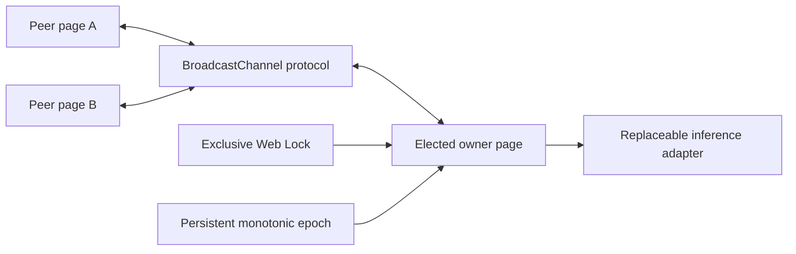

# TabLoom

[](https://github.com/aantenore/tabloom/actions/workflows/ci.yml)
[](https://github.com/aantenore/tabloom/actions/workflows/browser.yml)
[](https://github.com/aantenore/tabloom/actions/workflows/codeql.yml)

TabLoom is a same-origin browser inference broker. It coordinates sibling pages so one live page owns the inference runtime while peers stream requests through it.

It supplies the coordination layer, not a model runtime: exclusive ownership, monotonic fencing epochs, protocol validation, bounded admission, streaming sessions, cancellation, timeouts, takeover, and privacy-safe telemetry.

The core stays provider-neutral. A deterministic adapter exercises lifecycle behavior in every CI job, while a dedicated optional adapter composes [WebLLM 0.2.84](https://github.com/mlc-ai/web-llm) without bundling it into the core package.

> **Alpha:** the WebLLM path is verified separately on Chrome/WebGPU with an actual model. It is not a compatibility claim for every browser, GPU, model, or future WebLLM version. Transformers.js remains an unverified integration seam.

## Why

Loading the same local model in every open page can multiply scarce device memory. Browser runtimes already solve inference and generic election packages already solve ownership; TabLoom focuses on the missing inference-specific lifecycle across owner changes.

## Architecture



- Web Locks elect exactly one owner inside a storage bucket.
- Same-origin storage advances the fencing epoch while the lock is held.
- BroadcastChannel carries runtime-validated, versioned envelopes.
- Ports keep election, transport, clock, IDs, telemetry, and inference replaceable.
- Clients reject stale epochs and accept at most one terminal result per session.

## Install the prerelease archive

The alpha is distributed as a GitHub release archive rather than an npm registry publication.

```bash
curl -LO https://github.com/aantenore/tabloom/releases/download/v0.2.0-alpha.1/tabloom-0.2.0-alpha.1.tgz
pnpm add ./tabloom-0.2.0-alpha.1.tgz
```

Verify the adjacent `.sha256` asset before installing in a controlled delivery pipeline.

## Quick start

```ts
import {
  DeterministicInferenceAdapter,
  createBrowserBroker,
} from '@aantenore/tabloom';

const broker = createBrowserBroker({
  adapter: new DeterministicInferenceAdapter(),
  config: {
    namespace: 'my-app-local-inference',
    queueCapacity: 8,
    requestTimeoutMs: 30_000,
  },
});

const unsubscribe = broker.subscribe((snapshot, event) => {
  console.log(snapshot.role, snapshot.epoch, event?.type);
  if (event?.type === 'retry') {
    // Clear any partial presentation: streaming restarts on the new epoch.
  }
});

await broker.start();

const session = broker.request({ text: 'Explain fenced ownership.' });
try {
  for await (const chunk of session) {
    console.log(chunk.text);
  }
  console.log(await session.result);
} finally {
  unsubscribe();
  await broker.stop();
}
```

The deterministic adapter makes lifecycle behavior reproducible. Replace it with an application adapter for a real runtime; see [adapter integrations](docs/integrations.md).

## Optional WebLLM adapter

Install the tested peer explicitly, then import only the dedicated subpath:

```bash
pnpm add @mlc-ai/web-llm@0.2.84
```

```ts
import { createBrowserBroker } from '@aantenore/tabloom';
import { WebLlmInferenceAdapter } from '@aantenore/tabloom/adapters/webllm';

const broker = createBrowserBroker({
  adapter: new WebLlmInferenceAdapter({
    modelId: 'SmolLM2-360M-Instruct-q4f16_1-MLC',
    onProgress: ({ progress, text }) => {
      console.log(Math.round(progress * 100), text);
    },
  }),
  config: {
    maxConcurrent: 1,
    namespace: 'my-app-webllm',
    queueCapacity: 4,
    requestTimeoutMs: 180_000,
  },
});

await broker.start();
const session = broker.request({
  messages: [{ role: 'user', content: 'Explain fenced ownership.' }],
  stream_options: { include_usage: true },
});

for await (const chunk of session) {
  console.log(chunk.choices[0]?.delta.content ?? '');
}
console.log(await session.result);
```

The host chooses the model, model source, runtime config, cache policy, and prompt history. The request cannot switch the configured model. Keep `maxConcurrent: 1`: WebLLM interruption is engine-wide and the adapter rejects a competing generation.

## Session semantics

| Concern                  | Alpha contract                                                                                     |
| ------------------------ | -------------------------------------------------------------------------------------------------- |
| Ownership                | One Web Lock holder owns the adapter; peers do not initialize it                                   |
| Fencing                  | Every owner attempt carries a monotonically increasing epoch                                       |
| Streaming                | Chunks are ordered and deduplicated inside the current attempt                                     |
| Takeover                 | Pending work can restart on a newer owner; observe `retry` and replace partial presentation        |
| Terminal state           | A client session accepts one completion or typed failure                                           |
| Provider execution       | At-least-once across takeover; adapters with external side effects need their own idempotency key  |
| Admission                | Queue capacity is fixed by validated configuration; excess work fails with `BACKPRESSURE`          |
| Privacy-safe diagnostics | Built-in telemetry types expose lifecycle metadata, never request payloads or generated chunk data |

## Browser requirements

Serve from HTTPS, or loopback for development. The alpha requires Web Locks, BroadcastChannel, local storage, and cryptographic UUID support in the same storage partition.

The deterministic multi-page suite is locally verified with Playwright 1.61.1 against Chromium 149.0.7827.55, Firefox 151.0, and WebKit 26.5. Each engine exercises one-owner convergence, peer streaming, cancellation, backpressure, and owner takeover. The separate live lab targets installed Chrome with WebGPU; see the [compatibility matrix](docs/compatibility.md).

## Development

Requires Node.js 24 or newer and pnpm 11.13.0.

```bash
corepack pnpm install --frozen-lockfile
corepack pnpm dev
```

Open `http://127.0.0.1:4173`, then use **Open sibling tab** to build a visible cluster.

Run the complete local quality gate:

```bash
corepack pnpm check
corepack pnpm package:smoke
corepack pnpm test:browser
corepack pnpm run audit
```

Run the opt-in real-model gate only when downloading the configured model is acceptable:

```bash
TABLOOM_WEBLLM_LIVE=1 \
TABLOOM_WEBLLM_MODEL=SmolLM2-360M-Instruct-q4f16_1-MLC \
corepack pnpm test:live:webllm
```

## Evidence and boundaries

- [Delivery contract](docs/delivery-contract.md)
- [Architecture decision](docs/adr/0001-browser-broker.md)
- [Threat model](docs/threat-model.md)
- [Compatibility matrix](docs/compatibility.md)
- [Market and build-vs-buy review](docs/market-scan.md)
- [Operations runbook](docs/runbook.md)
- [Visual QA ledger](docs/visual-qa.md)

Cross-origin coordination, durable recovery after all pages close, mutually untrusted same-origin scripts, and exactly-once provider side effects are intentionally out of scope.

## License

Apache-2.0.
